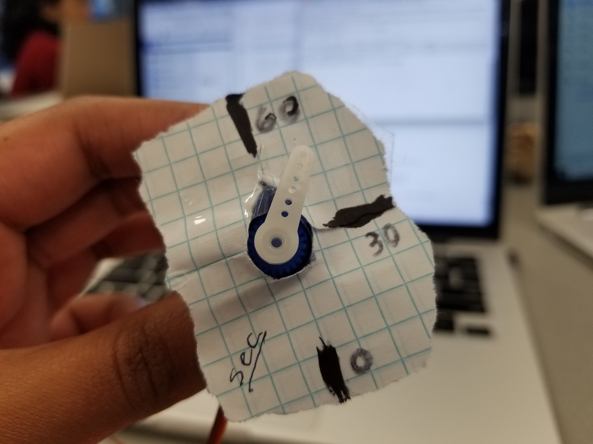

# Retro Clock: Digital and Analog
Authors: Vindhya Kuchibhotla, Jennifer Norell, Vanessa Schuweh

2019-09-20

## Summary

In this quest, we used the skills obtained over the past two weeks to display the same time to a digital and analog clock. We wired the Alphanumeric Display using I2C ports, we connected two servos using the 3V, GND, and two GPIO pins (one for each servo), and we used UART to drive console IO.

## Evaluation Criteria

We successfully demonstrated:
- Console IO to enter an initial time (whether if it is current time or any other time) by HH, MM, SS
- Input values are error checked: based on time validity, character validity, and length of input
- Reading in the hour and minutes console input (after error checking) to display onto the Alphanumeric display
- Initializing timing that increments by 1 second
- Initializing both servos according to specified input: this is obvious based on the starting location of the spinners
- Servos will restart at the zero mark once they reach the 60 minute and second point
- Measuring the tick marks on the servos to demonstrate the time

We didn't implement the alarm functionality, however the techincal aspects would include the following:
- In addition to current the time, the user will also be prompeted to input an alarm time in HH:MM:SS
- The program will scan the input string into a sperate variable in order to save both the current time and alarm time
- It will compare the two variables in a while loop and continue to increment the current time every second until the current time reaches the alarm time
- An LED will light up to indicate the alarm time has been reached and the current time will continue to increment

## Solution Design
Our void app_main() function configures and initializes all components and then prompts the user to enter time in HH, MM, and SS. This input is error checked for length of input(can't be longer than 2), non-number inputs(such as characters or spaces), and within valid range of hour and minutes and seconds (minutes and seconds must be less than 60; hour must be less than 24). Furthermore, the user can input a single number such as 3 and the program will take it as a valid input of 03. Finally, it will reprompt if the inputs do not pass the error checks. We then initialize our timer (using Timer Group 0, not ESP32 system time) with the flag to start incrementing by 1 second used in our while loop. This is similar to the implementation in the example code and in the powerpoint slides given. We then synchronize the display and servos based on the inputted time. Within our while loop, we modularized the program by calling a timeTime() function that increments all counters and updates both the display and servos (using our own function writeToDisplay() and using the ESP-IDF MCPWM Servo control function mcpwm_example_servo_control()). Because the timer goes by the seconds, the minutes hand servo automatically performs at 1/60th of the speed of the seconds hand servo and very little changes had to be made. To ensure that we can track the positioning of the handles on the servos, we restricted the maximum degree of each servo to 60 degrees and added tick marks to prove its functionality. Above all, our work utilizes the first 4 skills of the cluster with further edits to complete this quest.  

## Investigative Question
One solution to synchronize multiple ESP clocks would be using wifi to communicate between the two boards.  One ESP32 will read the pin values and transmit this data to the other board which will receive these values and output the results. Essentially one board is the “Master” and whatever is implemented to this board will be passed on and implemented on the other board, the “Slave”. 

## Sketches and Photos

  

wiring, tick marks on servos

## Supporting Artifacts
- [Link to repo](https://github.com/BU-EC444/Team7-Schuweh-Kuchibhotla-Norell/tree/master/quest-1)

- [Link to video demo](https://www.youtube.com/watch?v=EwzBtG1iFCE&feature=youtu.be)

- [Link to video presentation](https://www.youtube.com/watch?v=-TPU8nOdVDs&feature=youtu.be)

## References
We referenced ESP-IDF example code particularly for running the two servos (configuration, initializing, and control) and for monitoring time (initializing and setting the timer via Timer Group 0).
- [Link to ESP-IDF Servo Code Example](https://github.com/espressif/esp-idf/blob/master/examples/peripherals/mcpwm/mcpwm_servo_control/main/mcpwm_servo_control_example.c)
- [Link to ESP-IDF Timer Code Example](https://github.com/espressif/esp-idf/blob/17ac4bad7381e579e5a7775755cc25480da47d97/examples/peripherals/timer_group/main/timer_group_example_main.c)
- [Link to Timer ESP-IDF Documentation](https://docs.espressif.com/projects/esp-idf/en/latest/api-reference/peripherals/timer.html)
- [Link to Servo ESP-IDF Documentation](https://docs.espressif.com/projects/esp-idf/en/latest/api-reference/peripherals/mcpwm.html#_CPPv422mcpwm_deadtime_disable12mcpwm_unit_t13mcpwm_timer_t)

-----

## Reminders

- Video recording in landscape not to exceed 90s
- Each team member appears in video
- Make sure video permission is set accessible to the instructors
- Repo is private
