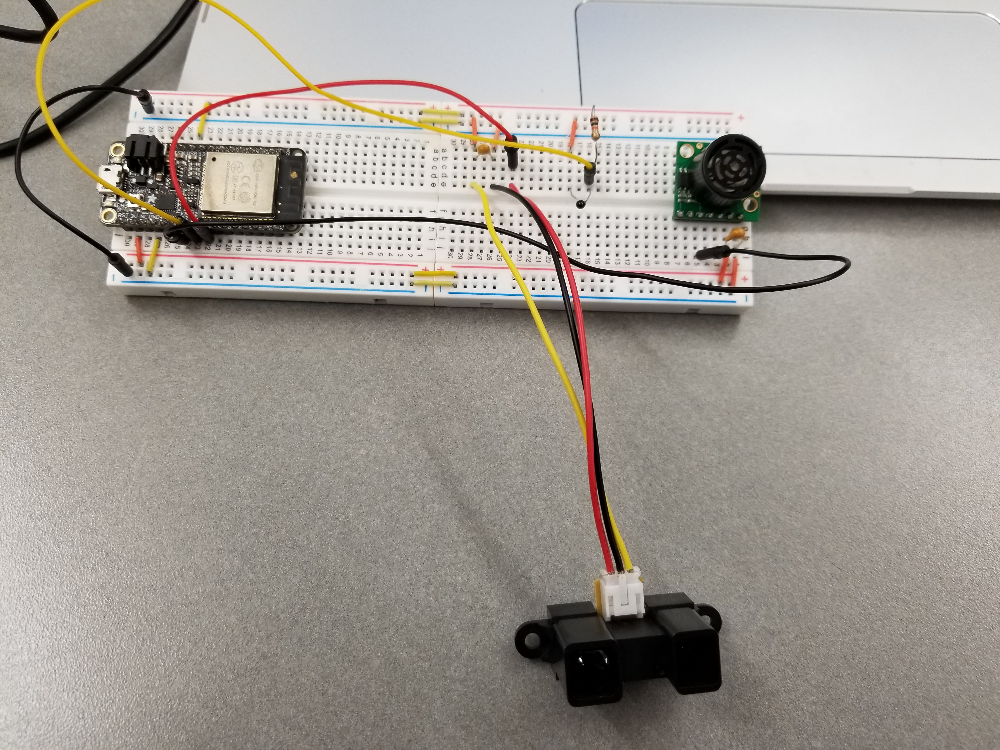

# Code Readme

All code files are in the folder code, while testing files are stored in folder testing.

Hardware Setup:

- sensors.c

- Ultrasonic: connected to analog input A2 and also GPI #34. It uses ADC1 channel 6.
- Thermistor: connected to analog input A3 and also GPI #39. It uses ADC1 channel 3.
- IR Rangefinder: connected to analog input A4 and also GPI #36. It uses ADC1 channel 0.

Server Side:

- dynamic-serial-read-plot.js
- log.txt

Client Side:

- dynamic-index.html
