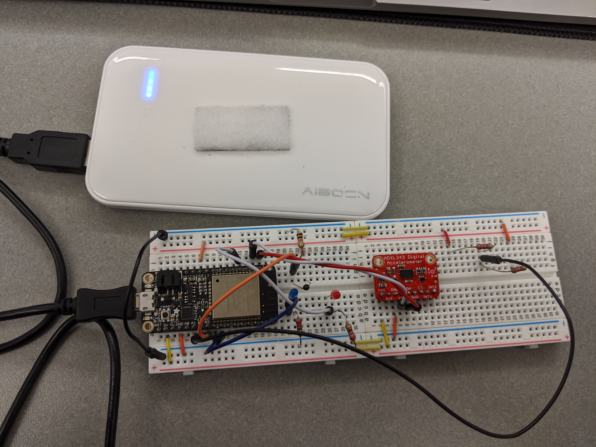
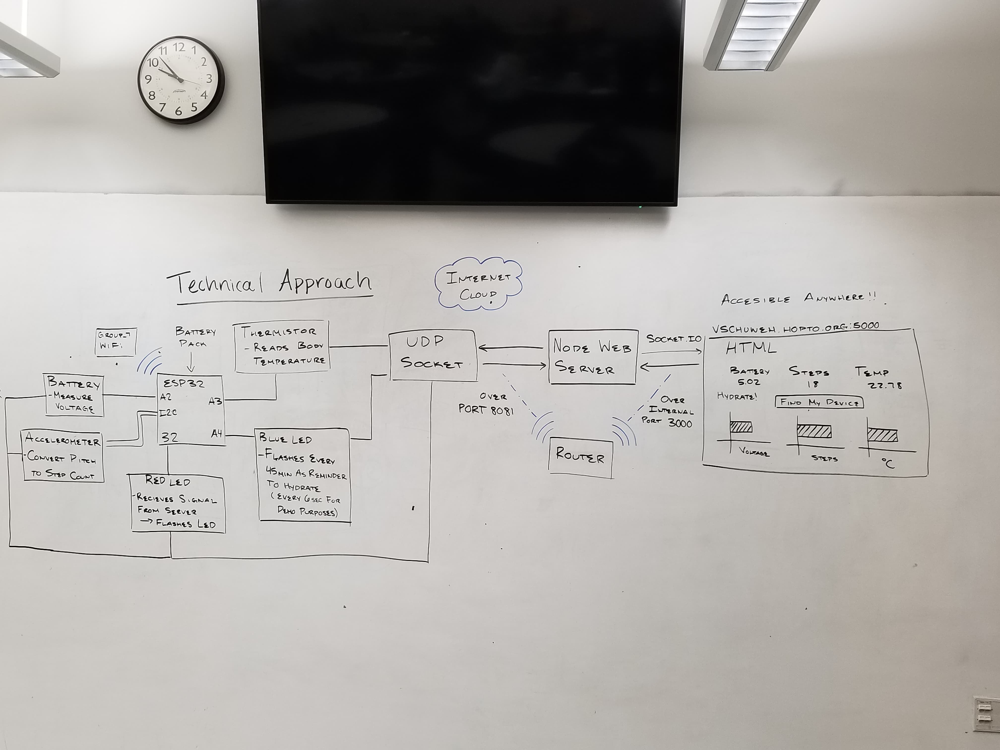
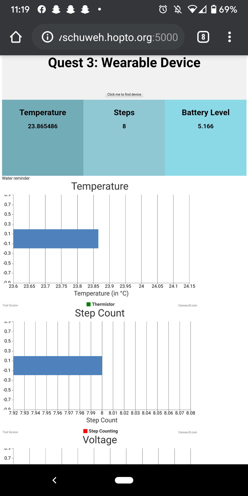

# Quest Name
Authors: Vindhya Kuchibhotla, Jennifer Norell, Vanessa Schuweh

2019-10-24

## Summary
In this quest, we used both skills from this quest and the past quest (Sensor Central) in order to create a makeshift fitbit. We integrated a thermistor, a battery monitor, and an accelerometer to track body temperature, battery life and step count. Additionally, we had two LEDs as alerts; one regularly sends reminders to drink water and the other flashes when the device is found by the web portal. All of this information is then sent to a web server via wireless connectivity and remote access. We displayed this on an html file that continuously updates every 2 seconds. The server is accessible at [vschuweh.hopto.org:5000](vschuweh.hopto.org:5000). 

## Evaluation Criteria

We successfully demonstrated:
    - Real time reporting of temperature in Celsius via thermistor, battery voltage via battery monitor, and the number of steps taken via accelerometer
    - Regularly scheduled alerts, via LED, to drink water
    - Reading and extracting this data from a CSV file and outputting in on a web server
    - Connecting the ESP to a web server and communicating wirelessly (via WiFi).

## Solution Design

udp_client.c allows the ESP to connect to our Group_7 WiFi and supports UDP sockets for communication from this client to a server over Port 8081. Once communication is established, data from the battery monitor, the thermistor, hydrate alert via blue LED, and steps calculated using Pitch values from the accelerometer are sent via a UDP socket.

Our solution accurately measures steps because it uses the pitch values from the accelerometer. If the pitch is less than -40 or greater than 15, then it is counted as a step. These threshold values were calibrated from multiple people testing the device by walking around.

In node_udp_server.js, we set up the server to receive datagrams on Port 8081. The message is read from the C file as a JSON, and this information is parsed and stored to a file, log.txt, in CSV format. The data is then extracted from the CSV and is stored in a variable data that is passed to the html via Socket.IO over localhost using Port 3000 (internal use). 

With port forwarding, our UI from client_graph.html is accessible from anywhere on any device, internally as port 3000 and externally as port 5000. The webpage consists of a graphical representation of the steps, voltage, and temperature, and prints the values. The UI includes a button to "Find the device" which sends this message from the webpage to the ESP32 to make the Red LED flash, proving the two-way communication established by printing sensor values from the ESP in real-time and communicating back to the ESP. When the hydration reminder flashes on the Blue LED, the web server also receives this message and prints the reminder.

## Investigative Question - What are steps you can take to make your device and system low power?
One thing that can be done to make our system low power would be to make peripherals sleep instead of idling. Meaning, instead of waiting for an external event, create an event that will wake up the peripheral when needed and allow it to sleep otherwise. Additionally, we are not turning off our sensors ever, but rather we are hiding that information. To make it more low powered, we could turn the sensors on and off in specific increments.

One approach we took for low power is that if the values read show that the steps aren't incrementing, the ESP will read and send data every 2 seconds instead of sending data at every step.

## Sketches and Photos

  

 

Wire up of device

  

 

System diagram

  

 

Server running on phone

## Supporting Artifacts
- [Link to repo](https://github.com/BU-EC444/Team7-Schuweh-Kuchibhotla-Norell/tree/master/quest-3/code)
- [Link to video demo](https://youtu.be/JWV9RhmJVww )
- [Link to video presentation](https://youtu.be/CAmuNYftCsQ)

## References

[Investigative Question](https://starfishmedical.com/blog/10-tips-for-ultra-low-power-embedded-design/)
[Investigative Question](https://en.wikipedia.org/wiki/Low-power_electronics)
[Whizzer Page](http://whizzer.bu.edu/quests/primary/wearable)
[CSS Template](https://www.w3schools.com/css/tryit.asp?filename=trycss_template1_float&fbclid=IwAR3HwKyZGqWEn8T4OggiUSeg7Kp5rGLKZu-9GVvohWBFp7ICTsZiSw34lw8)
[UDP Communication](http://whizzer.bu.edu/briefs/design-patterns/dp-sockets)
[I2C Brief](http://whizzer.bu.edu/briefs/design-patterns/dp-i2c)
[ADXL343 Base Code](https://github.com/BU-EC444/code-examples/tree/master/i2c-accel)
[ESP I2C API](https://docs.espressif.com/projects/esp-idf/en/latest/api-reference/peripherals/i2c.html)
[Tilt Sensing](https://wiki.dfrobot.com/How_to_Use_a_Three-Axis_Accelerometer_for_Tilt_Sensing)

-----

## Reminders

- Video recording in landscape not to exceed 90s
- Each team member appears in video
- Make sure video permission is set accessible to the instructors
- Repo is private
