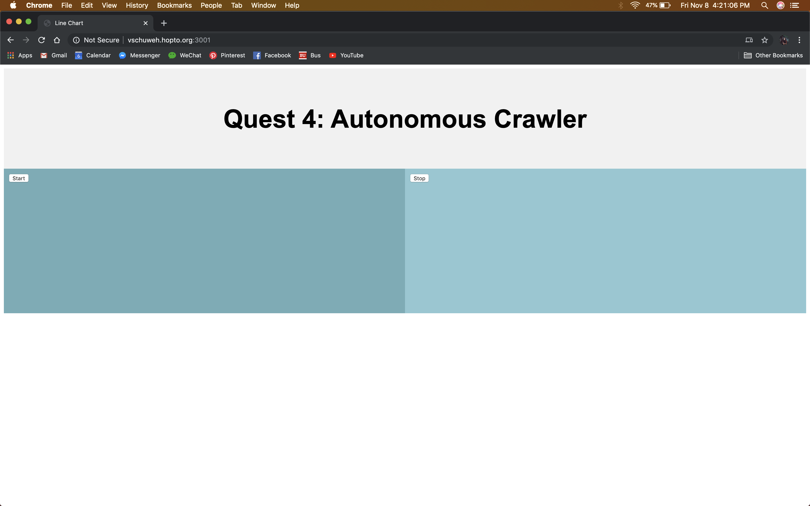

# Autonomous Driving
Authors: Vindhya Kuchibhotla, Jennifer Norell, Vanessa Schuweh

2019-11-08

## Summary
In this quest, we used all of the skills assigned for this quest, as well as a few from past quests in order to create an autonomously driving car. We did this by using a total of three distance sensors: two microLIDAR sensors on the sides to detect distance from the walls to keep the car driving in the middle of the course, and one LIDAR sensor at the front of the crawler for collision prevention. Additionally, we integrated an optical detector that sensed the speed of our crawler and these values were outputted on the alphanumeric display. We used this sensor in conjunction with PID to maintain a constant velocity. In order to power all of the sensors we utilized the 5v USB port from the ESP and drew 5v from the ESC because the combination of all sensors draw too much current for a single power source to sustain.

## Evaluation Criteria

We successfully demonstrated:
- PID for speed control, holding velocity between 0.1 - 0.3m/s (shown in class demo)
- Steering for centering the crawler and driving a straight path
- Avoiding collisions (stopping at 10 cm of the wall)
- Controlling the car remotely via a Node server
- Reading distances from 4 distinct sensors (LIDAR, 2 microLIDARs, and optical detector)
- Displaying the speed of the crawler using alphanumeric

## Solution Design
The main program consists of 3 tasks running simultaneously:

The first task is designed to run a timer and calculate the velocity of the car using pulse counter. It counts the number of pulses the sensor detects in a certain time period to convert to rpm which is then used to calculate m/s. We used the pcnt and timer_group examples from the espidf as our base code and modified it to include the the speed calculation.

Second, the program waits to receive a signal from the web server either to start or stop the crawler. If a signal is received the start_flag will go high, directing the crawler to start driving. Using port forwarding, our UI is accessible from anywhere on any device, internally using port 3333 and externally on port 3001, which allows our crawler to be controlled remotely. Our server consists of two buttons to start and stop our crawler.

Lastly, the move_task integrates all the components together. If the start_flag from the previous task goes high and the LIDAR sensor detects no collision then it will begin to start moving. The program will proceed to call the PID function and steering function. In PID, following the design pattern, the program will get the current speed from the first task and instruct the crawler to either increment the speed if it's moving slower than 0.2m/s or decrement the speed if the crawler is driving faster then 0.2m/s. The steering function compares the distances obtained from the microLIDARs. If the distance aren't equivalent, the crawler will be instructed to steer towards the center (making the distances equal) then maintain a straight path from there. When comparing distances, there is a margin of error. If the difference of the measured distances exceed that error then the crawler will steer if not it will maintain its line.

## Investigative question: Define what you would want in a better sensor for the vehicle.

We are currently using the LiDAR sensor and the MicroLiDAR sensors.  We found that not only was one of the MicroLiDAR sensors inaccurate, but also they did not function properly if the crawler was charged enough. All three sensors needed an input voltage of 5 which makes power consumption hard to manage. Therefore, in a better sensor we would ideally want a lower power, more accurate sensor. The LiDAR sensor was highly accurate but also took a lot of power and had the same issue as the microLiDAR when the crawler had low power. For example, the ultrasonic sensor may have worked well because its input voltage can be as low as 2.5 volts, but its range only went to 5 meters, whereas the MicroLiDAR went to 12 meters.

## Sketches and Photos

Screenshot of web server control with stat and stop buttons

Wiring of our crawler and alphanumeric displaying speed of crawler as it's moving

Diagram of our technical approach

## Supporting Artifacts
* [Link to repo](https://github.com/BU-EC444/Team7-Schuweh-Kuchibhotla-Norell/tree/master/quest-4/code)
* [Link to video demo](https://www.youtube.com/watch?v=CbTtVT7sb4g)
* [Link to video presentation](https://youtu.be/hdr5qHsQ3SM)

## References

* [ Wheel Speed ](https://docs.espressif.com/projects/esp-idf/en/latest/api-reference/peripherals/pcnt.html)
* [ Wheel Speed ](https://docs.espressif.com/projects/esp-idf/en/latest/api-reference/peripherals/timer.html)
* [ Wheel Speed ](https://learn.sparkfun.com/tutorials/qrd1114-optical-detector-hookup-guide#example-circuit)
* [ MicroLIDAR ](https://cdn.sparkfun.com/assets/5/e/4/7/b/benewake-tfmini-datasheet.pdf)
* [MicroLIDAR](https://www.sparkfun.com/products/14588)
* [Calibration](http://whizzer.bu.edu/briefs/design-patterns/dp-esc)
* [PID](http://whizzer.bu.edu/briefs/design-patterns/dp-pid)
* [PID](https://docs.espressif.com/projects/esp-idf/en/latest/api-reference/peripherals/timer.html)
* [LIDAR](https://www.robotshop.com/community/blog/show/lidar-lite-laser-rangefinder-simple-arduino-sketch-of-a-180-degree-radar)
* [LIDAR](https://www.robotshop.com/media/files/pdf/operating-manual-llm20c132i500s011.pdf)
* [Investigative Question](https://www.sparkfun.com/distance_sensor_comparison_guide)
* [Investigative Question](https://wonderfulengineering.com/10-best-proximity-sensor-modules-for-electronics-project/)

* [Investigative Question]()
* [Investigative Question]()

-----

## Reminders

- Video recording in landscape not to exceed 90s
- Each team member appears in video
- Make sure video permission is set accessible to the instructors
- Repo is private
